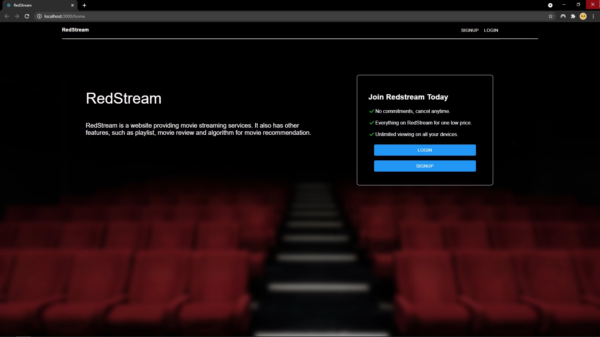
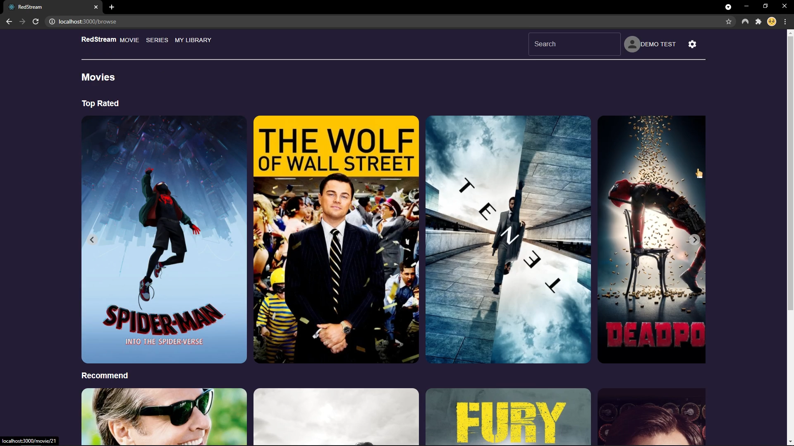
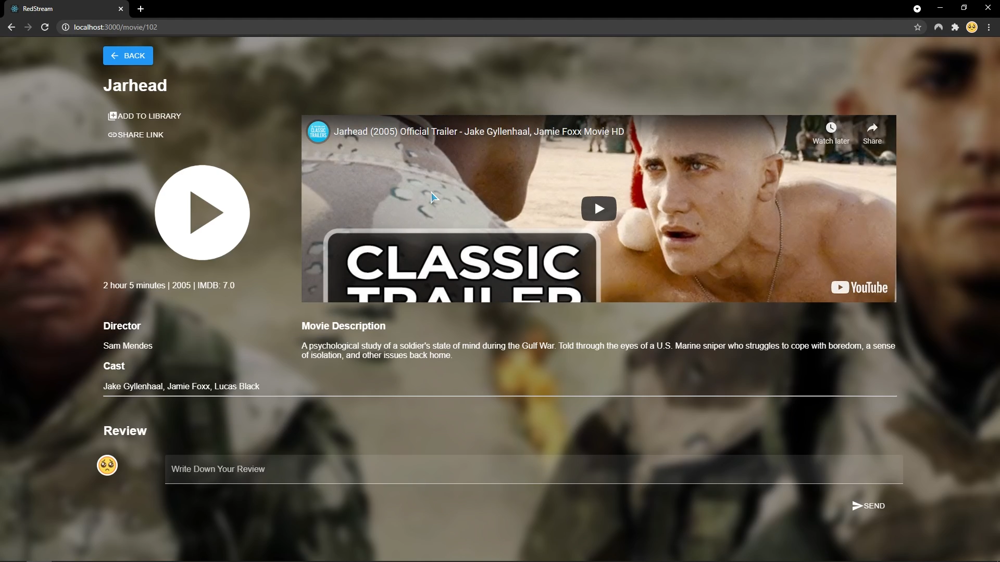
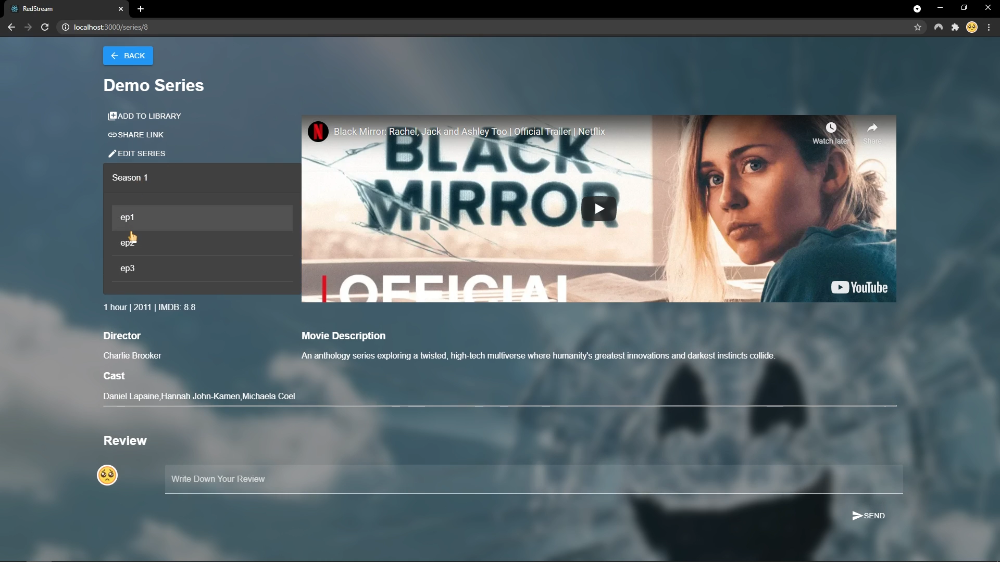
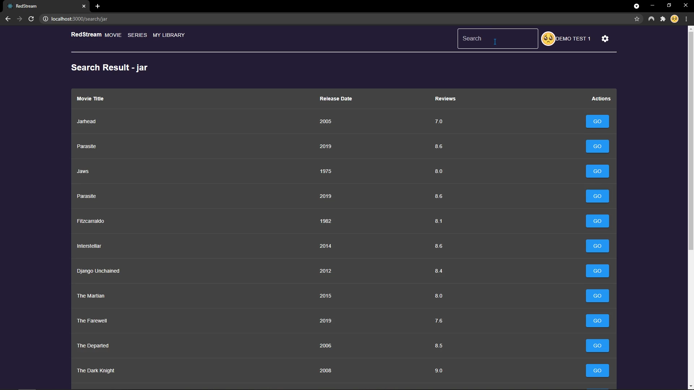
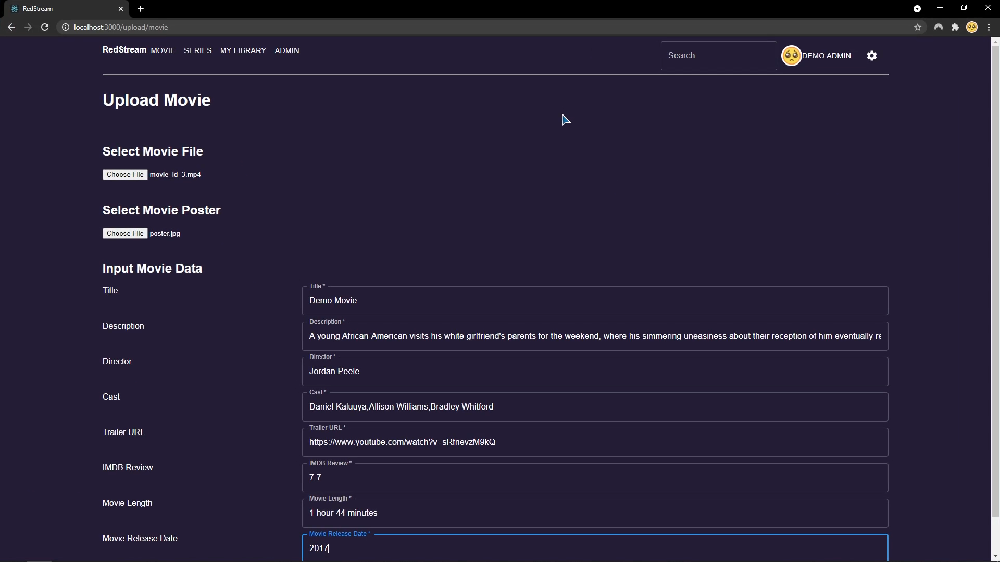
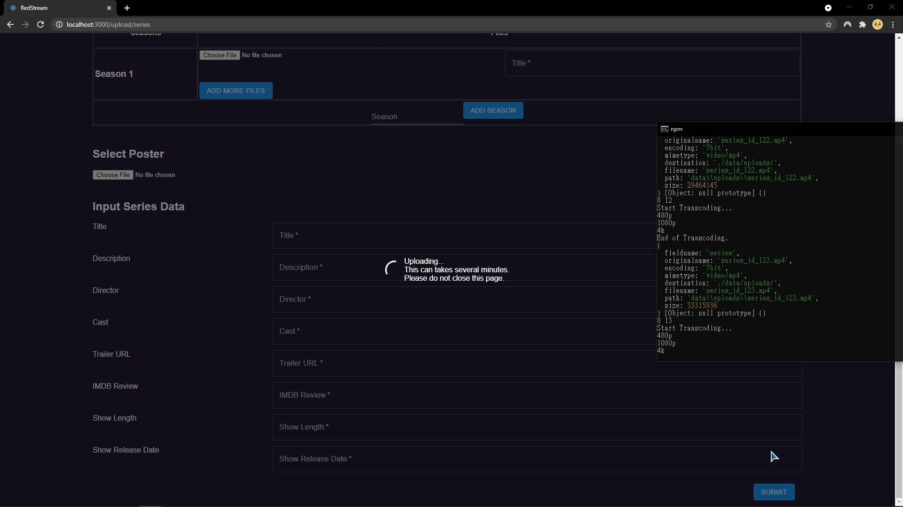
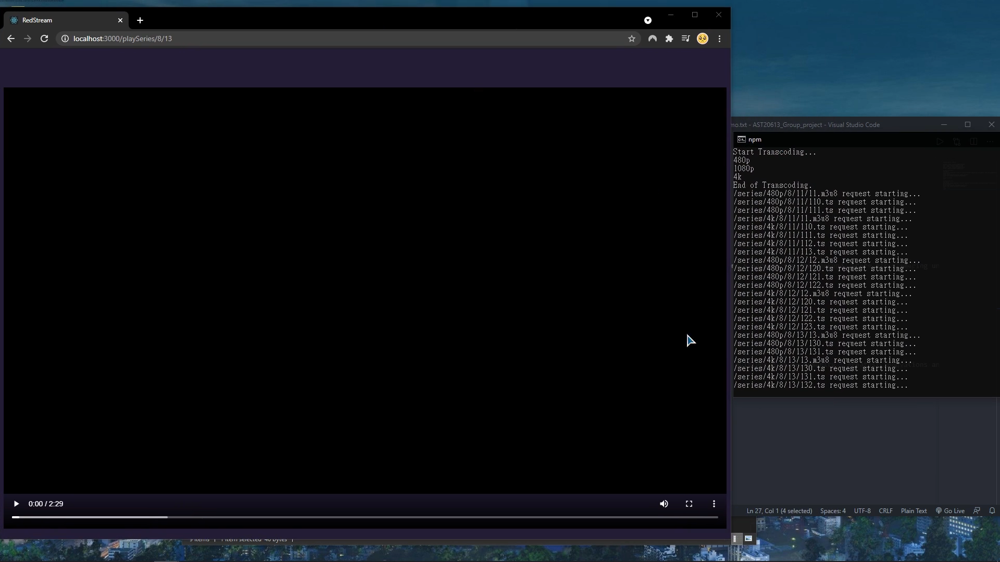
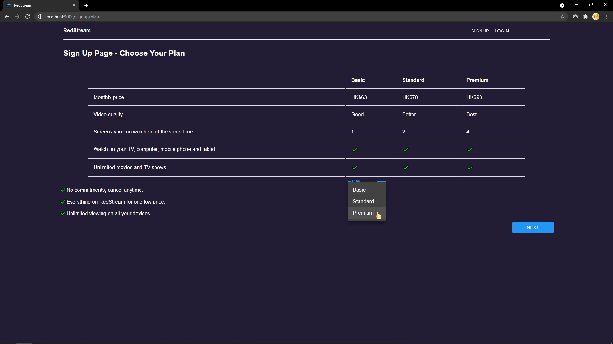
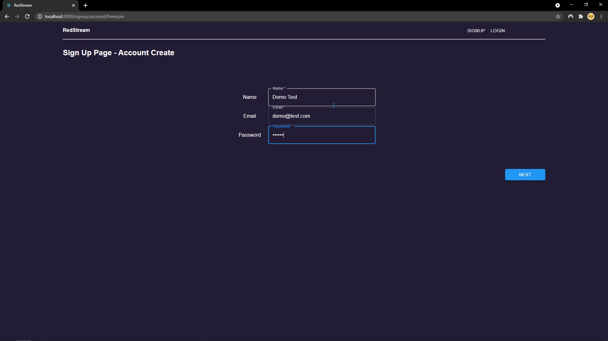

# RedStream
RedStream - a Movie Streaming Website built with [ReactJS](https://reactjs.org/), [MaterialUI](https://mui.com/), [ExpressJS](https://expressjs.com/), [Firebase](https://firebase.google.com/) and [FFmpeg](https://ffmpeg.org/).

## Who Made This?
- Sanjay THAPA
- SINGH Pawandeep
- FAN Tsz Kin
- KO Chun Kit
- SZE Chun

## Screenshot

## Let's Get Started!
1. Clone this repo
2. Go to the directory of the repo
3. Double click start_backend.bat
4. Double click start_frontend.bat
5. Done

## Demo Admin Account
- email: admin@redstream.com
- pwd: redstream

## Demo User Account
- email: test@test.com
- pwd: testes

## Learn More
This is a Group Project built in 2021 for the Final Year Project of the Associate Degree in Information System Development.

The following tech is used in this project.
- [ReactJS](https://reactjs.org/) - the frontend framework of this project.
- [MaterialUI](https://chakra-ui.com/) - the UI solutions of this project.
- [Firebase](https://www.mysql.com/) - the database of this project.
- [ExpressJS](https://www.mysql.com/) - the backend of this project.
- [FFmpeg](https://www.mysql.com/) - the video encoder of this project.
